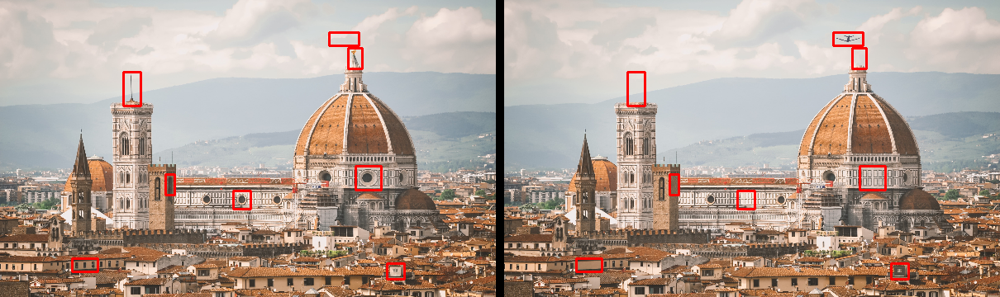
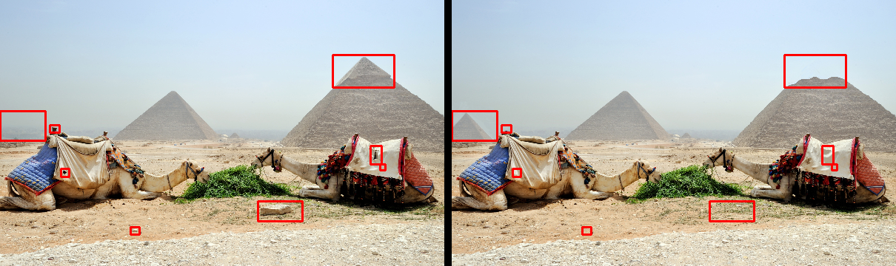

# Spot-The-Differences-OpenCV
Spot the differences between two images using Python and OpenCV. For a better and visual understanding of this project and it's concepts, watch the video : [Spot the Differences]()

<p align="center">

</p>

## Main Idea
This program can spot-find the differences between two images. The user loads to the program 2 images that are mostly the same but also have some small differences. By running the program user gets both images side by side with their differences highlighted.

We will check two methods. For the first method we will use images *city1.jpg* and *city2.jpg* (Photo by [Fede Roveda](https://www.pexels.com/@fede-roveda-1461538?utm_content=attributionCopyText&utm_medium=referral&utm_source=pexels) from [Pexels](https://www.pexels.com/photo/brown-and-white-concrete-building-4179480/?utm_content=attributionCopyText&utm_medium=referral&utm_source=pexels)) and for the second we will use images *camels1.jpg* and *camels2.jpg* (Photo by [Travel Photography](https://www.pexels.com/@travel-photography-1146107?utm_content=attributionCopyText&utm_medium=referral&utm_source=pexels) from [Pexels](https://www.pexels.com/photo/camels-eating-plants-2183784/?utm_content=attributionCopyText&utm_medium=referral&utm_source=pexels))

## First Method
### Using *cv2.absdiff*. Script [*img_diff1.py*](https://github.com/kostasthanos/Spot-The-Differences-OpenCV/blob/main/img_diff1.py)
First we are loading the two images.
```python
img1 = cv2.imread('path_to_image_1')
img2 = cv2.imread('path_to_image_2')
```
<p align="center">


</p>

Then we are converting both images to grayscale format.
```python
gray1 = cv2.cvtColor(img1, cv2.COLOR_BGR2GRAY)
gray2 = cv2.cvtColor(img2, cv2.COLOR_BGR2GRAY)
```

Now it's time to find the absolute difference between the two images (arrays).
```python
diff = cv2.absdiff(gray1, gray2)
cv2.imshow("diff(img1, img2)", diff)
```

Apply threshold. Apply both THRESH_BINARY and THRESH_OTSU.
```python
thresh = cv2.threshold(diff, 0, 255, cv2.THRESH_BINARY | cv2.THRESH_OTSU)[1]
cv2.imshow("Threshold", thresh)
```

We are going to use 2 iterations of dilation in order to increase the white region in threshold.
```python
kernel = np.ones((5,5), np.uint8) 
dilate = cv2.dilate(thresh, kernel, iterations=2) 
cv2.imshow("Dilate", dilate)
```

Finally we are calculating the contours and draw rectangles in both images which are corresponding to the differences between the 2 images.
```python
contours = cv2.findContours(dilate.copy(), cv2.RETR_EXTERNAL, cv2.CHAIN_APPROX_SIMPLE)
contours = imutils.grab_contours(contours)
```

The results are the following : 
<p align="center">

</p>

## Second Method
### Using *compare_ssim*. Script [*img_diff2.py*](https://github.com/kostasthanos/Spot-The-Differences-OpenCV/blob/main/img_diff2.py)
Let's load our two images.
<p align="center">


</p>

We are following the steps of the First Method with some small changes. Instead of **cv2.absdiff**, now we are computing the full structural similarity (*similar*) between the two gray images. Also we must convert *diff* array in range [0, 255].
```python
(simalr, diff) = compare_ssim(gray1, gray2, full=True)
diff = (diff*255).astype("uint8")
```

After deleting the dilation part from first method we are calculating the contours as before. The results are the following :
<p align="center">

</p>

**Note :** For a better understanding of the two methods you can check the two scripts [*img_diff1.py*](https://github.com/kostasthanos/Spot-The-Differences-OpenCV/blob/main/img_diff1.py) and [*img_diff2.py*](https://github.com/kostasthanos/Spot-The-Differences-OpenCV/blob/main/img_diff2.py) which are having all the necessary comments for a better explanation of each method's step.

Check also the youtube video : [Spot the differences](...)

## Author
* **Konstantinos Thanos**
